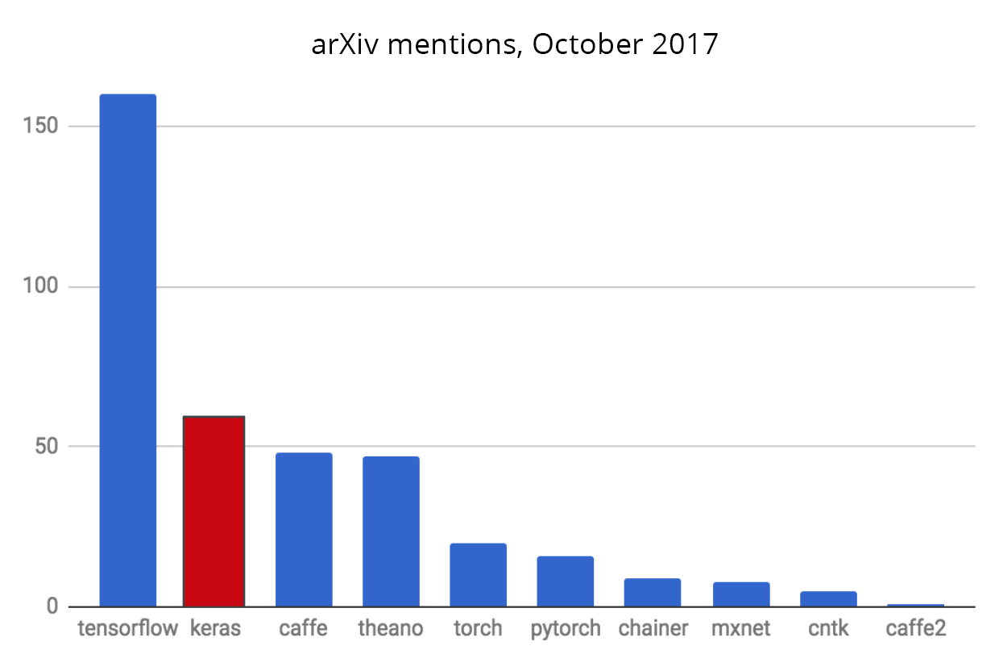

```{r setup, include=FALSE}
knitr::opts_chunk$set(echo = TRUE)
```

现在有无数的深度学习框架可用。为什么使用KLAS而不是其他？下面是Keras与现有替代品相比的一些领域:  

***  

**Keras优先考虑开发者体验**   
  Keras是为人类而不是机器而设计的API。  
  这使得Keras易于学习和易于使用。  
  这种易用性并不以灵活性的降低为代价：因为Keras集成了较低级别的深度学习语言（特别是TensorFlow），它使您可以实现在基础语言中可以构建的任何东西。Keras API与 TensorFlow 无缝集成。  

***  

**Keras在业界和研究界广泛采用**
  
  
_Jeff Hale基于7个类别的11个数据源统计的深度学习框架_ 

截至2018年年中，Keras拥有超过25万个个人用户，除了TensorFlow本身（而Keras API现在是TensorFlow的官方前端），它在业界和研究界都比任何其他深度学习框架具有更强的适用性。  
您已经经常与用Keras构建的特性进行交互——它正在Netflix、Uber、Yelp、Instacart、Zocdoc、Square和许多其他公司使用。它在初创企业中尤为流行，他们把深度学习放在产品的核心位置。  
Keras也是深层学习研究人员的最爱，成为 [arXiv.org](https://arxiv.org/archive/cs)在科学论文中第二词条:  
  
Keras也被大型科学组织的研究人员采纳，特别是欧洲核子研究中心(CERN)和美国国家航空航天局(NASA)。  

***

**Keras很容易将模型转化为产品**  
  Keras模型可以比其他任何深度学习框架更容易地部署在更大范围的平台上：  
  
  + 在iOS上，通过 [Apple's CoreML](https://developer.apple.com/documentation/coreml)（由苹果官方提供的Keras支持)
  + 在Android上，通过TensorFlow Android runtime.示例： [Not Hotdog app](https://medium.com/@timanglade/how-hbos-silicon-valley-built-not-hotdog-with-mobile-tensorflow-keras-react-native-ef03260747f3)  
  + 在浏览器中，通过GPU加速JavaScript运行时，如[Keras.js](https://transcranial.github.io/keras-js/#/)和[WebDNN](https://mil-tokyo.github.io/webdnn/)。  
  + 在谷歌云上，通过[TensorFlow-Serving](https://www.tensorflow.org/serving/)   
  + 在R或Python Webapp后端(如 Shiny或Flask app)  

***

**Keras支持多个后端引擎，并不会将你限定在一个生态系统中**  
  
您的Keras模型可以用不同[深度的学习后端](https://keras.rstudio.com/articles/backend.html)开发。重要的是，任何keras模型，利用内置的层将所有这些后端的可移植性：你可以用一个后端的训练模型，并与另一个负载（例如部署）。可用后端包括：  

  + TensorFlow 后端(来自谷歌)  
  + CNTK后端(来自微软)  
  + Theano后端  

亚马逊目前也在为Keras开发MXNET后端.  

这样，您的Keras模型可以在CPU之外的多个不同硬件平台上进行训练： 

  + [NVIDIA GPUs](https://developer.nvidia.com/deep-learning)  
  + [Google TPUs](https://cloud.google.com/tpu/),通过TensorFlow后端和Google云  
  + OpenCL-enabled GPUs 比如那些AMD通过[the PlaidML Keras backend](https://github.com/plaidml/plaidml)   

***

**Keras拥有强大的支持多GPU和分布式模型训练的功能**  

  + Keras内置多GPU数据并行支持[](https://keras.rstudio.com/reference/multi_gpu_model.html)  
  + [Horovod](https://github.com/uber/horovod)来自Uber，对Keras模型有一流的支持  
  + keras模型可以[转换成TensorFlow Estimators](https://www.tensorflow.org/versions/master/api_docs/python/tf/keras/estimator/model_to_estimator)并在[谷歌云上的GPU集群](https://cloud.google.com/solutions/running-distributed-tensorflow-on-compute-engine)上进行训练  
  + Keras可以通过Dist-Keras(from CERN)和 Elephas在Spark上运行  

***  

**Keras的发展是由深度学习生态系统中关键公司支持的**  
Keras开发主要由谷歌支持，Keras API在TensorFlow封装为tf.keras.此外，微软维护CNTK Keras后端。亚马逊AWS正在开发MXNET支持。其他贡献的公司包括Nvidia、Uber和Apple（与CoreML）。  

  